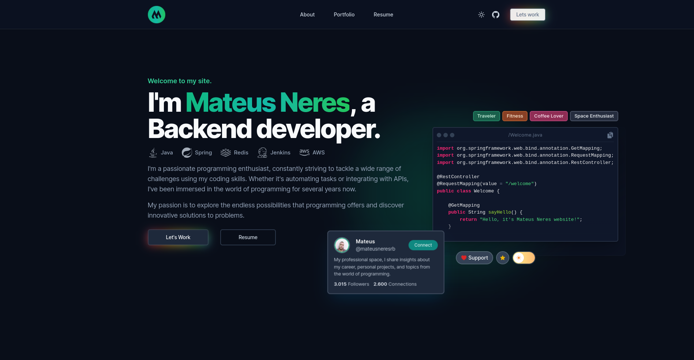
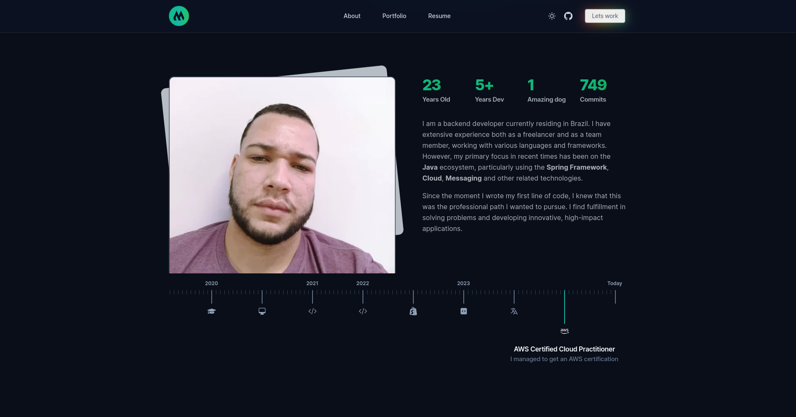
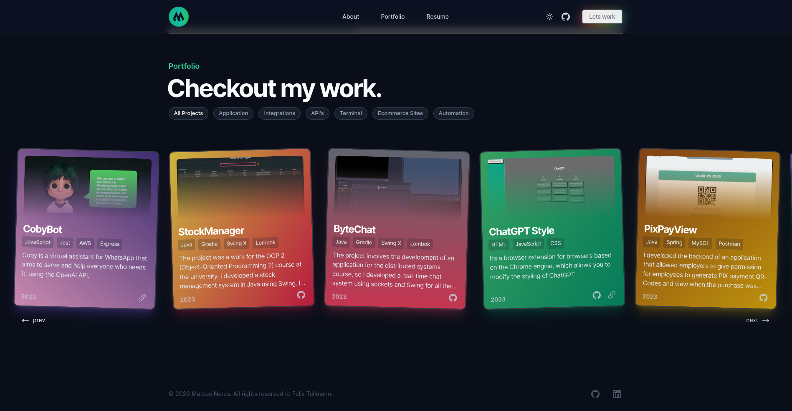
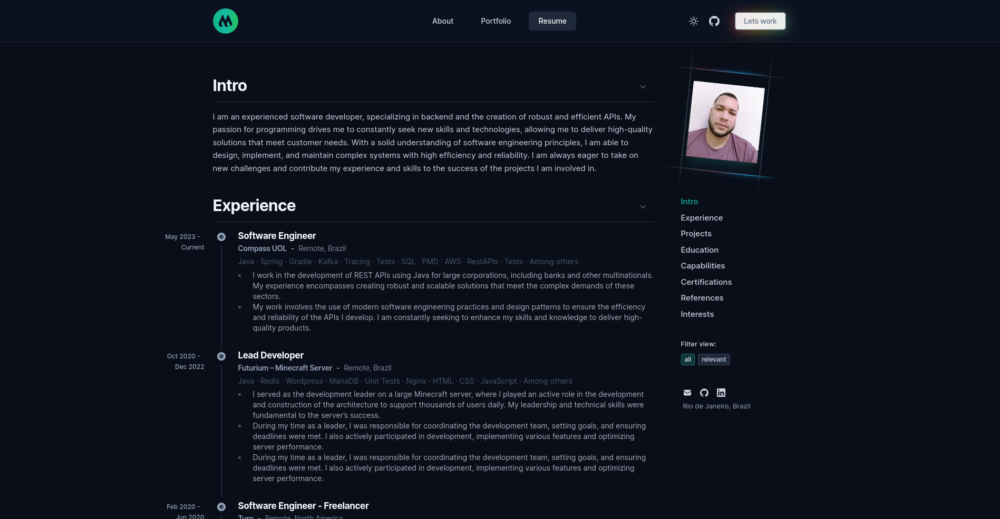

# my-website
> This is my personal website, which contains personal information and my projects so far, as well as my resume.

This is a fork of [flext](https://github.com/FelixTellmann/flext) all design and development rights to the site are reserved to him, with his permission I just adapted the website to my context.

## 🏠 [Home](https://mateusneres.dev/)
In this first part I can describe a little about my area of focus in the development industry and demonstrate some of the technologies I've already used, as well as the website's color switcher and donation link.

## 🧔 [About](https://mateusneres.dev/#about)
Here I show a timeline of my life and career, from my first line of code to the present day, also specifying the development time and my current age.

## 🗂️ [Portfolio](https://mateusneres.dev/#portfolio)
In this part I specify some of my latest projects, with descriptions about them and in some cases I've put the link to the project and the code from the github repository.

## 📄 [Resume](https://mateusneres.dev/resume)
It's in the resume that I put my skills, latest professional experiences and other career issues within the field of technology. 

## 🤝 Credits
Special thanks to [Felix Tellmann](https://github.com/FelixTellmann/) for allowing me to use this website to create my portfolio.